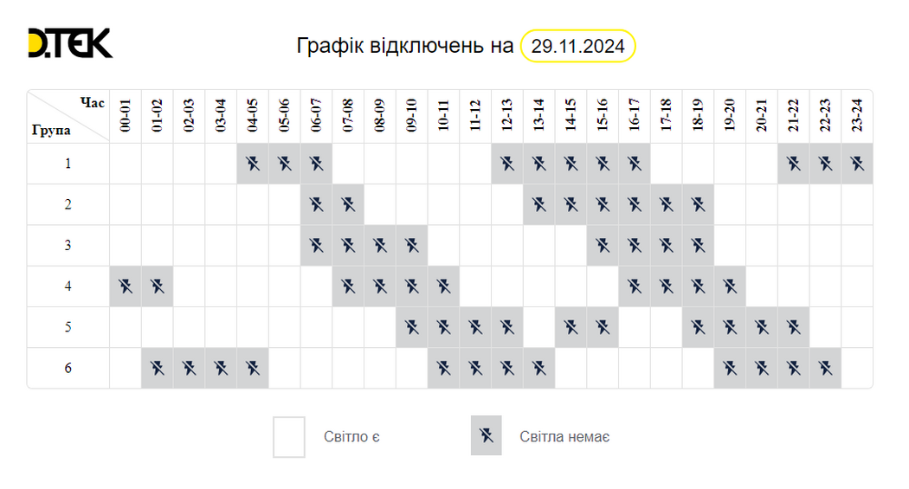
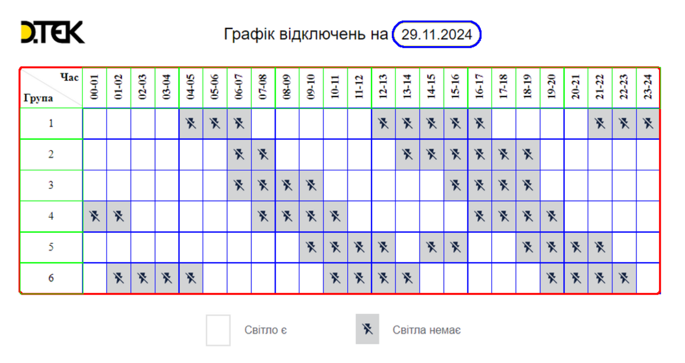

# BSN - Blackout Schedule Notifier

This is a bash script and companion python app that:

- fetches blackout schedule from DTEK website every 30 minutes
- converts the schedule image into JSON representation
- if the schedule has changed - sends a Telegram message using Bot API

## Showcase

Here is what we get from the DTEK website.



Below the contour detection and grid recognition results achieved with ``python-opencv``. The ``pytesseract`` library helps to recognize the schedule date on the image.



And here is a final JSON output:

    {
      "date_time": "29.11.2024",
      "blackouts": {
        "1": [
          {
            "start": "04:00",
            "end": "07:00"
          },
          {
            "start": "12:00",
            "end": "17:00"
          },
          {
            "start": "21:00",
            "end": "00:00"
          }
        ],
        "2": [
          {
            "start": "06:00",
            "end": "08:00"
          },
          {
            "start": "13:00",
            "end": "19:00"
          }
        ],
        "3": [
          {
            "start": "06:00",
            "end": "10:00"
          },
          {
            "start": "15:00",
            "end": "19:00"
          }
        ],
        "4": [
          {
            "start": "00:00",
            "end": "02:00"
          },
          {
            "start": "07:00",
            "end": "11:00"
          },
          {
            "start": "16:00",
            "end": "20:00"
          }
        ],
        "5": [
          {
            "start": "09:00",
            "end": "13:00"
          },
          {
            "start": "14:00",
            "end": "16:00"
          },
          {
            "start": "18:00",
            "end": "22:00"
          }
        ],
        "6": [
          {
            "start": "01:00",
            "end": "05:00"
          },
          {
            "start": "10:00",
            "end": "14:00"
          },
          {
            "start": "19:00",
            "end": "23:00"
          }
        ]
      }
    }


# Instructions

## Prerequisites

* Install [Tesseract OCR](https://github.com/tesseract-ocr/tesseract)
  - macOS: `brew install tesseract`
  - Ubuntu/Debian: `apt-get install tesseract-ocr`
  - Windows: Download installer from the repository
* Python 3.8 or higher
* Required system tools: `curl`, `md5sum` (or `md5` on macOS)

## Setup

1. **Clone the repository**
   ```bash
   git clone <repository-url>
   cd blackout-schedule-notifier
   ```

2. **Install Python dependencies**
   ```bash
   pip install -r requirements.txt
   ```

3. **Configure environment variables**
   
   Create a `.env` file in the project root with the following variables:
   
   ```bash
   # Required: Telegram Bot Token for sending notifications
   TELEGRAM_BOT_TOKEN=your_bot_token_here
   
   # Required: JSON mapping of Telegram chat IDs to blackout groups
   # Format: {"chat_id": ["group1", "group2"], "another_chat_id": ["group3"]}
   CHAT_ID_TO_BLACKOUT_GROUPS={"123456789": ["1", "2", "3"]}
   ```

   **How to get these values:**
   - `TELEGRAM_BOT_TOKEN`: Create a bot via [@BotFather](https://t.me/botfather) on Telegram
   - `CHAT_ID_TO_BLACKOUT_GROUPS`: 
     - Chat ID: Use [@userinfobot](https://t.me/userinfobot) to get your chat ID
     - Groups: Numbers 1-6 representing DTEK blackout groups

## Running the Downloader Locally

The `downloader.sh` script supports two modes of operation:

### Mode 1: Image Mode (Default)

Downloads schedule images from the DTEK website and processes them using OCR.

```bash
./downloader.sh
# or explicitly:
./downloader.sh --images
```

**What it does:**
1. Downloads PNG schedule images from `https://www.dtek-oem.com.ua/ua/shutdowns`
2. Saves images to `in/` directory with MD5 checksum filenames
3. Processes images using OCR (Tesseract) to extract schedule data
4. Converts recognized data to JSON format
5. Saves results to `out/` directory
6. Sends Telegram notifications if schedule changed

### Mode 2: HTML/JSON Mode

Downloads HTML page and extracts structured JSON data directly (no OCR needed).

```bash
./downloader.sh --html
```

**What it does:**
1. Downloads HTML from `https://www.dtek-oem.com.ua/ua/shutdowns`
2. Extracts `DisconSchedule.fact` JavaScript object from the page
3. Saves JSON to `in/` directory with MD5 checksum filename
4. Processes JSON data directly (faster and more reliable than OCR)
5. Converts to internal format and saves to `out/` directory
6. Sends Telegram notifications if schedule changed

### Manual Processing

You can also manually process files using `main.py`:

**Process an image:**
```bash
python src/main.py \
  --input_dir in \
  --src in/your_image.png \
  --out_dir out \
  --group_log group_logs \
  --mode image
```

**Process a JSON file:**
```bash
python src/main.py \
  --input_dir in \
  --src in/your_data.json \
  --out_dir out \
  --group_log group_logs \
  --mode json
```

### Directory Structure

- `in/` - Input files (downloaded images or JSON)
- `out/` - Processed schedule JSON files
- `group_logs/` - Tracks schedule changes per blackout group for notifications

**Note:** The script automatically maintains only the 10 most recent files in each directory to save disk space.

## Running with Docker

Build and run using Docker Compose:

```bash
docker-compose up -d
```

The container runs the downloader every 30 minutes via cron.